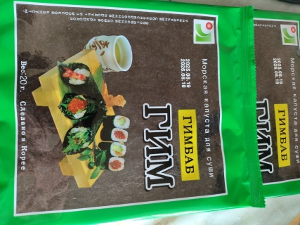

# Фото 1: Нори (김) - Сушёные водоросли для кимбапа

**Производитель:** Корея  
**Вес:** 20г  
**Срок годности:** до 08.18.2026

---

## Что это
Листы сушёной водоросли порфира. Готовы к употреблению, не требуют варки.

## Как использовать

### ✅ Вприкуску
- Просто отламывай кусочек и ешь с рисом/гречкой/картошкой
- Хрустящие, солёные - отлично заменяют хлеб

### ✅ В суп
- Добавляй в мисо-суп, рамен, обычный куриный бульон
- Режь полосками прямо в тарелку перед едой
- Или кроши в кастрюлю за 2 минуты до готовности

### ✅ Посыпка
- Покроши на яичницу/омлет
- Посыпь отварной рис с маслом
- Добавь в салат из огурцов/помидоров

## Полезные свойства
- Богаты йодом, витаминами A, B12
- Низкокалорийны (~35 ккал на 10г)
- Источник минералов

## Хранение
⚠️ Храни в сухом месте, иначе станут мягкими и невкусными!