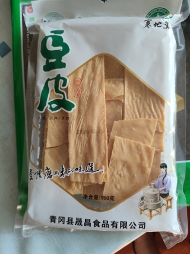

# Фото 2: Ду Пи (豆皮) - Соевая кожа / Соевые листы

**Производитель:** 青冈县晟昌食品有限公司 (Qinggang County Shengchang Food Co., Ltd.)  
**Бренд:** 寒地黑 (Han Di Hei)  
**Вес:** 150г  
**Дата производства:** 15.01.2026

---

## Что это
Плёнка, снимаемая с поверхности горячего соевого молока. Также называют "фу жу" (腐竹) или "соевая кожа". Высокобелковый продукт. На упаковке указано применение: 火锅/凉拌/烹炒 (хот-пот / холодные закуски / жарка).

## Как использовать

### ✅ В пароварку
- Можно в сухом виде - водяного пара хватит, чтобы размягчилась за 15-20 минут готовки
- Или замочи на 10 мин перед добавлением - будет мягче и быстрее приготовится

### ✅ Как добавить к обеду (курица/котлеты + мексиканская смесь)
- Порви на кусочки и добавь к курице/котлетам + мексиканской смеси
- Впитает соки и ароматы, станет как губка
- Добавит белка и текстуры

### ✅ Ещё варианты
- В суп (куриный бульон) - за 10 мин до готовности
- Отдельно потушить с соевым соусом + чесноком (5-7 мин) = готовая добавка к гарниру
- Холодная закуска - замочить, отжать, полить соевым соусом с кунжутом

## Полезные свойства
- Отличный источник растительного белка (~50г на 100г сухого продукта)
- Содержит кальций и железо
- Низкокалорийный (~400 ккал на 100г сухого)

## Хранение
⚠️ Храни в сухом месте. После замачивания - в холодильнике не более 2-3 дней.
⚠️ После замачивания обязательно отожми лишнюю воду!