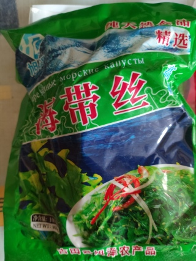

# Фото 5: Сушёная морская капуста (ламинария соломкой)

**Название:** 海带丝 (Haidai Si)  
**Вес:** 200г  
**Тип:** Сушёная ламинария, нарезанная соломкой

---

## Что это
Сушёная морская капуста (ламинария). Требует замачивания перед употреблением. Хранится долго, можно использовать позже.

## Общие способы применения

### ✅ Замачивание
- Залить холодной водой на 20-30 минут (или тёплой на 10-15 мин)
- Увеличивается в 3-5 раз
- После замачивания промыть и отжать

### ✅ Варианты использования
- **В суп** (куриный бульон, мисо) - варить 10-15 минут
- **В пароварку** к обеду - добавить к курице/овощам
- **Салат** - замочить, смешать с огурцом, чесноком, соевым соусом
- **Гарнир** - потушить с соевым соусом и специями

## С чем сочетается
- Соевый соус, имбирь, чеснок, уксус
- Кунжутное масло
- Грибы (шиитаке)
- Рис, лапша
- Огурцы, морковь

## Полезные свойства
- Рекордсмен по йоду
- Много клетчатки и альгинатов
- Низкокалорийна
- Витамины A, C, E, группы B

## Хранение
✅ Сухую - в сухом месте (хранится годами)  
⚠️ После замачивания - в холодильнике 2-3 дня  
⚠️ Много йода - не злоупотребляй (2-3 раза в неделю достаточно)

---
**Статус:** Отложено на потом. Возможно для супа или восточных блюд.