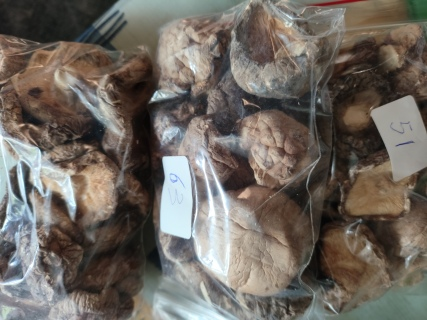

# Фото 6: Сушёные грибы шиитаке (香菇)

**Название:** 香菇 (Xiānggū)  
**Тип:** Сушёные грибы шиитаке  
**Статус:** Отложено на следующую неделю

---

## Что это
Классические азиатские грибы с сильным ароматом "умами". Сушёные — перед готовкой обязательно замачивать. Аромат намного насыщеннее, чем у свежих шампиньонов.

## Как готовить

### ✅ Замачивание (обязательно!)
- Залить горячей водой на 20-30 минут
- Ножки лучше срезать — они жёсткие, в блюда идут только шляпки
- Воду от замачивания НЕ выливать — это концентрированный бульон!

### ✅ Варианты использования
- В суп — шляпки в куриный бульон за 15 мин до готовности
- В пароварку — к курице/овощам/мексиканской смеси
- Тушёные — с соевым соусом + чеснок + имбирь
- В лапшу/рис — обжарить с овощами
- Вода от замачивания — как основа для соуса или супа

## С чем сочетается
- Соевый соус, имбирь, чеснок, кунжутное масло
- Курица, говядина, свинина
- Овощи, лапша, рис
- Ду Пи (фото 2) — отличное сочетание!

## Полезные свойства
- Укрепляют иммунитет (содержат лентинан)
- Снижают холестерин
- Витамин D, группы B
- Белок (~20г на 100г сухих)

## Хранение
✅ Сухие — годами в сухом месте  
⚠️ После замачивания — в холодильнике 3-4 дня  
⚠️ Аромат очень сильный — не переборщи, 5-6 шляпок на кастрюлю достаточно

---
**План:** Эту неделю едим первые фото как добавки к обычным блюдам. На следующей неделе — новые блюда из грибов и водорослей!