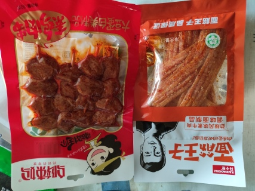

# Фото 3: Два острых снека - Соевые кусочки и Палочки из глютена

**Снек 1 (слева):**邬辣妈 (Wu La Ma) - Соевые "шашлычки" в остром соусе  
**Состав:** Соевый белок (大豆蛋白类制品)  
**Вес:** 80г

**Снек 2 (справа):** 开小差 (Kai Xiao Chai) - "Принц глютена" (面筋王子)  
**Состав:** Пшеничный глютен, острая приправа (劲辣风味素牛肉 - острый вкус вегетарианской говядины)  
**Вес:** 76г

---

## Что это
Два популярных китайских острых снека. Левый - текстурированный соевый белок в маринаде, правый - палочки из пшеничного глютена (сейтан) со специями. Оба готовы к употреблению.

## Как использовать

### ✅ В прикуску с пресным салатом
- Идеально! Салат (огурцы/помидоры/капуста) сбалансирует остроту
- Не нужно готовить - просто открой и ешь

### ✅ Покрошить в пароварку
- Порви на кусочки и добавь к курице/овощам за 5-10 мин до готовности
- Даст остроту и вкус всему блюду
- Начни с небольшого количества (может быть очень остро!)

### ✅ Ещё варианты
- В лапшу/рис - добавит остроты и белка
- В суп - за 2-3 мин до готовности (бульон станет острее)
- С яйцом - с омлетом или варёным яйцом

## Полезные свойства
- Высокое содержание белка (соевый и пшеничный)
- Низкое содержание жира
- Содержат специи и аминокислоты

## Хранение
⚠️ Много соли и специй - не злоупотребляй  
⚠️ Если слишком остро - промой водой перед едой  
⚠️ Лучше как добавка/приправа, не как основное блюдо  
✅ Хранить в прохладном сухом месте, после вскрытия - в холодильнике