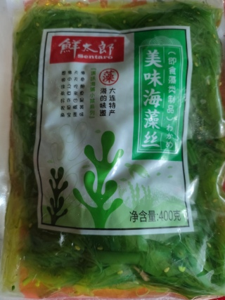

# Фото 4: Вакаме - Готовый салат из морских водорослей

**Бренд:** 鲜太郎 (Sentaro)  
**Вес:** 400г  
**Тип:** Готовый салат вакаме в маринаде (即食藻类制品)

---

## Что это
Уже замоченные и приправленные водоросли вакаме (морской виноград) в маринаде с кунжутным маслом, сахаром и уксусом. Готовы к употреблению.

## Как использовать

### ✅ Как самостоятельная закуска
- Просто открой пакет и ешь вилкой (уже вкусная и пряная)
- Холодный салат - не требует приготовления

### ✅ С яйцом и авокадо (завтрак)
- Нарежь яйцо и авокадо, добавь вакаме
- Получится азиатский завтрак-боул

### ✅ К обеду (курица/котлеты/мексиканская смесь)
- Добавляй в самом конце, когда еда уже в тарелке
- Просто положи сверху как холодный гарнир
- Контраст горячей курицы и холодной хрустящей вакаме

### ✅ С овощами
- Идеально смешать с огурцами и помидорами
- Заменит собой заправку (там уже есть масло и уксус)

## ⚠️ Важно
- **НЕ варить и не греть долго** - превратится в кашу и потеряет хруст!
- После вскрытия хранить в холодильнике
- Съесть за 3-5 дней после вскрытия, иначе закиснет
- Использовать в первую очередь!

## Полезные свойства
- Богаты йодом, витаминами и минералами
- Низкокалорийны
- Источник омега-3 жирных кислот
- Улучшают пищеварение

## Хранение
⚠️ После вскрытия - только в холодильнике!  
⚠️ Съесть за 3-5 дней  
⚠️ Не замораживать